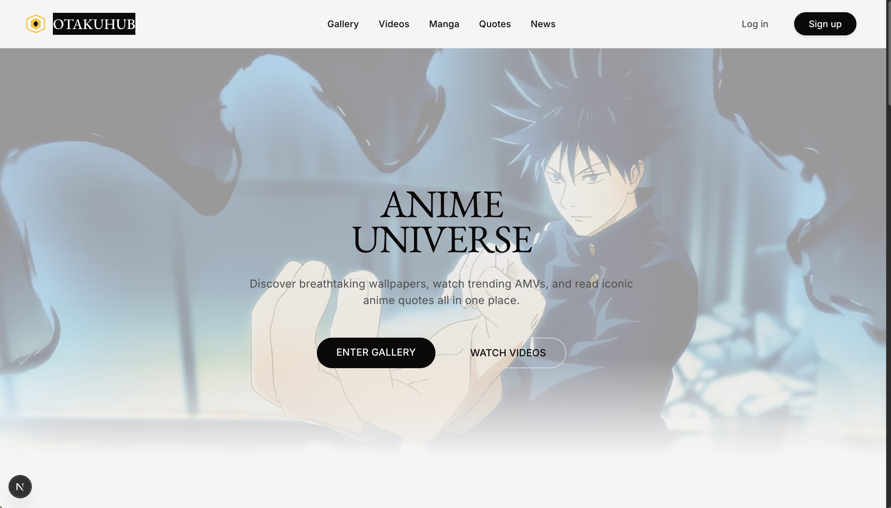
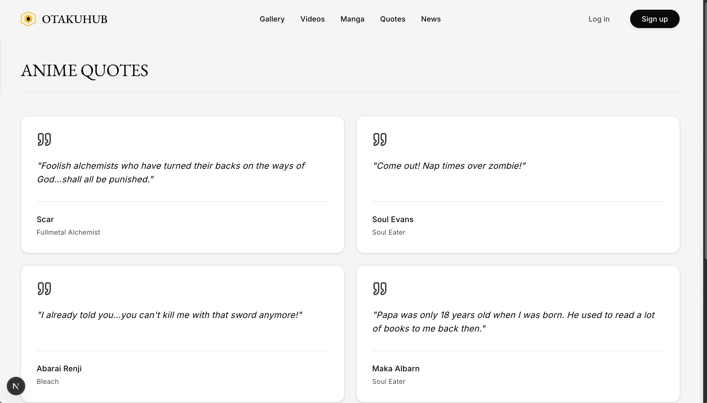

# OtakuHub
> The Ultimate Modern Destination for Anime Enthusiasts.


---

## 📺 Visual Demo
> *Dive into a premium, ad-free anime and manga experience directly from your browser.*





---

## 📖 Project Description

**OtakuHub** is a full-stack web application designed for anime lovers who want a unified, aesthetic platform for all their media needs. Built with an uncompromising focus on UI/UX, it solves the problem of navigating cluttered, ad-ridden sites by offering a sleek, dark-mode native environment.

### Core Features
- **📚 Manga Reader:** A custom, fully-integrated manga reader sourcing chapters via WeebCentral (via Consumet API) with native fullscreen support.
- **🎬 Video Streaming:** High-quality anime video streaming directly on the platform.
- **🖼️ Aesthetic Gallery:** Curated anime artwork and wallpapers dynamically fetched and presented in a responsive masonry grid.
- **📰 Anime News:** The latest industry news aggregated and cleanly formatted using a custom Readability parser.
- **💬 Anime Quotes:** A daily dose of iconic anime quotes.
- **🔐 User Authentication:** Secure login and registration powered by NextAuth and MongoDB to manage user profiles and save your favorite media.

---

## 🚀 Installation Guide

Get OtakuHub up and running on your local machine in seconds.

### Prerequisites
- Node.js (v18+)
- MongoDB connection string

### Setup Steps

1. **Clone the repository**
   ```bash
   git clone https://github.com/deepanshu-verma-codes/otaku-hub.git
   cd otaku-hub
   ```

2. **Install dependencies**
   ```bash
   npm install
   ```

3. **Configure Environment Variables**
   Create a `.env` file in the root directory and add the following keys:
   ```env
   MONGODB_URI="your_mongodb_connection_string"
   NEXTAUTH_SECRET="your_random_nextauth_secret"
   NEXTAUTH_URL="http://localhost:3000"
   ```

4. **Run the Development Server**
   ```bash
   npm run dev
   ```

---

## 💻 Usage Examples

Once the development server is running, navigate to `http://localhost:3000` to interact with the application.

- **To read Manga:** Click on "Manga" in the navigation bar, search for a title (e.g., *Solo Leveling*), and click to open the immersive reader. Use the top-right button to toggle Fullscreen mode.
- **To view News:** Navigate to the "News" section to see cleanly extracted articles without the bloat of external ads.
- **To manage Favorites:** Sign up for an account, log in, and utilize the dropdown avatar menu to navigate to your Profile and Favorites.

---

## 🤝 Contributing Guidelines

Contributions, issues, and feature requests are welcome! 

1. Fork the project
2. Create your feature branch (`git checkout -b feature/AmazingFeature`)
3. Commit your changes (`git commit -m 'Add some AmazingFeature'`)
4. Push to the branch (`git push origin feature/AmazingFeature`)
5. Open a Pull Request

---

## 📄 License

This project is licensed under the **MIT License**. You are free to modify and distribute the code as you see fit.
